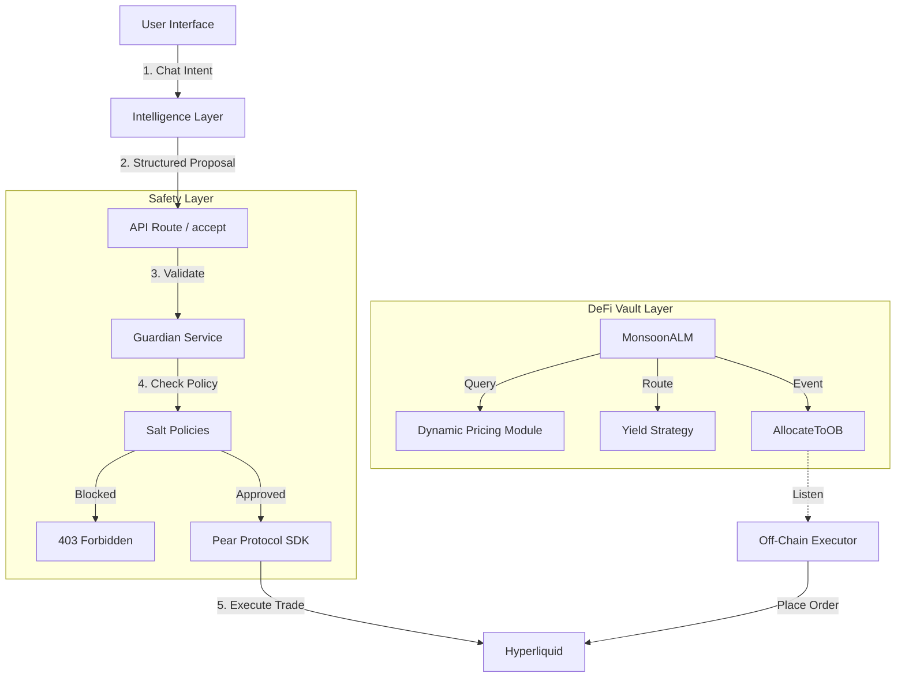

# Monsoon: The AI Agentic Asset Manager

**Monsoon** is an intelligent asset management protocol built for the **Salt & Valantis Hackathon**. It bridges the gap between on-chain DeFi liquidity and off-chain AI execution, protected by Salt's robust guardrail infrastructure.

---

## 🚀 Key Features

### 1. 🛡️ Guarded AI Agents (Salt + Pear Protocol)
Monsoon enables users to trade via natural language ("Buy $100 ETH") while enforcing strict safety policies.
- **Middleware Interception**: All AI intents are intercepted by our `GuardianService` before execution.
- **Policy Enforcement**: Trades exceeding limits (e.g., >$250/trade or restricted assets) are **blocked instantly** before reaching the chain.
- **Execution**: Validated intents are executed efficiently on **Hyperliquid** via the **Pear Protocol** SDK.

### 2. 💧 Sovereign ALM (Valantis)
A custom Automated Liquidity Manager (ALM) built on Valantis Sovereign Pools that intelligently routes liquidity.
- **Dynamic Pricing**: Calculates Bid/Ask spreads based on inventory skew and real-time oracle data via the `HyperCoreQuoter`.
- **Yield Allocation**: Automatically routes idle capital to yield-bearing strategies (Mocked Chorus One/Aave adapters) to maximize efficiency.
- **Orderbook Integration**: Emits `AllocateToOB` events to sync on-chain reserves with off-chain CLOB orders.

### 3. ⚡ Off-Chain Executor
A TypeScript-based service that listens to on-chain ALM events and mirrors them on the Hyperliquid orderbook in real-time.

---

## 🏗️ System Architecture

### High-Level Flow



### Component Integration (Salt + HyperEVM)

```
┌─────────────────────────────────────────────────────────────────────┐
│                         USER INTERFACE                               │
│  (Next.js Dashboard - Trade, Vault, Agent, Guardians pages)        │
└─────────────────────────────┬───────────────────────────────────────┘
                              │
                              ▼
┌─────────────────────────────────────────────────────────────────────┐
│                      SALT POLICY LAYER                              │
│  src/salt/policies.ts      │  src/salt/gatedActions.ts              │
│  ─────────────────────────   ─────────────────────────              │
│  • DepositPolicy           │  • gatedDeposit()                      │
│  • RebalancePolicy         │  • gatedRebalance()                    │
│  • OBOrderPolicy           │  • gatedOBOrder()                      │
│  • PolicyValidator         │                                        │
│                            │  ↓ VALIDATES before execution          │
└────────────────────────────┼────────────────────────────────────────┘
                             │
          ┌──────────────────┴──────────────────┐
          │                                     │
          ▼                                     ▼
┌─────────────────────────┐         ┌─────────────────────────────────┐
│   HYPEREVM CONTRACTS    │         │      OFF-CHAIN EXECUTOR         │
│   (On-chain)            │         │      src/executor/index.ts      │
│   ─────────────────────  │         │      ─────────────────────────  │
│   MonsoonALM:           │◄────────┤   • Listens for AllocateToOB   │
│   • deposit()           │  events │   • Places orders on HyperCore  │
│   • withdraw()          │         │   • Uses Salt OBOrderPolicy     │
│   • allocateToOB()      │         │                                 │
│   • deallocateFromOB()  │         │                                 │
│                         │         │                                 │
│   HyperCoreQuoter:      │         └─────────────────────────────────┘
│   • getMidPrice() ◄─────┼─── Calls HyperCore precompile (0x800)
│                         │
└─────────────────────────┘
```

---

## � Security Model

### Salt Policy Layers

| Layer | Enforcement | Purpose |
|-------|-------------|---------|
| **Deposit Policy** | Max per-tx, daily limits | Prevent oversized deposits |
| **Rebalance Policy** | Max allocation %, cooldowns | Prevent aggressive OB exposure |
| **OB Order Policy** | Spread limits, size caps | Prevent market manipulation |
| **Agent Policy** | Max Spend ($250), Venue | Prevent autonomous agent errors |

### Gated Actions
All sensitive operations go through Salt validation off-chain before on-chain execution or API calls:

```typescript
const result = await GuardianService.validateTradeRequest(request);
if (!result.success) {
  return NextResponse.json({ error: "Policy Violation" }, { status: 403 });
}
```

---

## �🛠️ Setup & Installation

### Prerequisites
- Node.js v20+
- `pnpm` or `npm`
- Arbitrum Sepolia RPC URL

### 1. Clone & Install
```bash
git clone https://github.com/wifimoney/monsoonhackathon.git
cd monsoonhackathon
npm install
```

### 2. Environment Configuration
Create `.env.local`:
```bash
NEXT_PUBLIC_WALLETCONNECT_PROJECT_ID="your_id"
OPENROUTER_API_KEY="your_key" # For Agent Chat
EXECUTOR_PRIVATE_KEY="your_pk" # For OB Executor
```

### 3. Running the App
```bash
# Start the Next.js Frontend
npm run dev
```
Access the dashboard at `http://localhost:3000`.

### 4. Running the Executor
To enable the Orderbook syncing service:
```bash
# In a separate terminal
export EXECUTOR_PRIVATE_KEY="your_private_key"
npx tsx src/executor/index.ts
```

---

## 📜 Deployed Addresses (Arbitrum Sepolia)

| Contract | Address | Description |
|----------|---------|-------------|
| **MonsoonALM** | `0x63825fb627b0e85b2f70a3b42fe530c7e6d72498` | Main liquidity module |
| **SovereignPool** | `0x82b785a3ab55772c88381c4387083399422cdfcd` | Valantis AMM pool |
| **HyperCoreQuoter** | `0x37f4e2a0a4a59f2a0405c4e539a39d90cf355d84` | Price oracle from HyperCore |
| **MockFactory** | `0x2746977b2921af42984f7d7f64597890d6e7f351` | Pool factory |
| **Token0 (mUSDC)** | `0xaa6a7b7faa7f28566fe5c3cfc628a1ee0583a0ba` | Mock USDC |
| **Token1 (mWETH)** | `0xe4e118a0b252a631b19789d84f504b10167466e2` | Mock WETH |

---

## 📁 Project Structure

```
monsoonhackathon/
├── contracts/                    # Foundry smart contracts
│   ├── src/
│   │   ├── MonsoonALM.sol       # Core liquidity module
│   │   ├── HyperCoreQuoter.sol  # Price oracle
│   │   └── interfaces/          # Contract interfaces
│
├── src/
│   ├── app/                      # Next.js app router
│   │   ├── dashboard/            # Dashboard pages
│   │   └── api/                  # API routes (Agent + Pear)
│   ├── components/               # React components
│   ├── lib/
│   │   ├── contracts/            # ABIs, addresses, wagmi hooks
│   │   └── guardian-service.ts   # Salt Policy Middleware
│   ├── executor/                 # OB executor service
```

---

## 👥 The Team
Built with ❤️ for the Salt & Valantis Hackathon.
